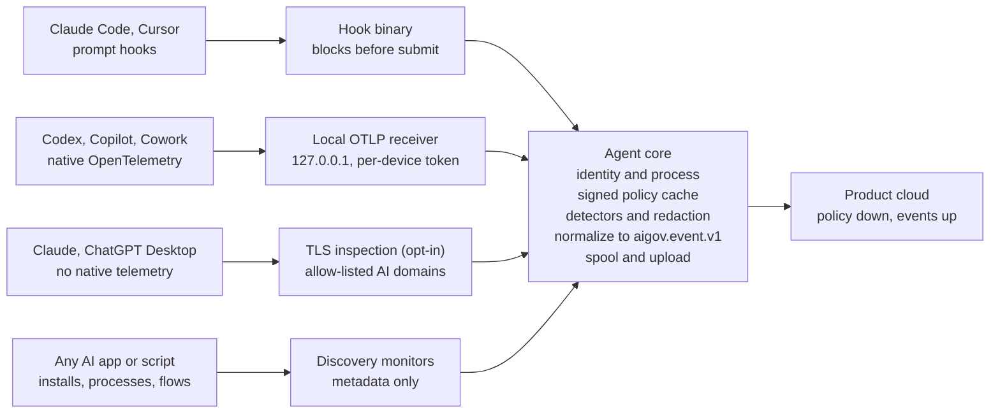

# Endpoint agent: overview and implementation tasks

Oct 6, 2026

The owner's source document, kept unchanged for reference. `DESIGN.md` maps it onto this repository
and the task folders implement it; where they differ from this document, they win.

## Overview

Build the endpoint agent as a layered collector: OpenTelemetry and vendor hooks for prompt content where tools offer them, process and connection monitoring for discovery everywhere, and selective on-device TLS inspection only for the apps that offer neither. Your OTel assumption is right, and it is also what Harmonic does, but OTel alone covers a handful of tools and gives visibility without blocking.

The agent's job on each managed laptop:

1. **Discover** every AI app, CLI, IDE extension, local model and direct inference API call, tied to the process and the user.
2. **Collect prompts** from tools that expose them (OTel, hooks), with consent-driven content capture.
3. **Enforce** in real time where a hook or local proxy allows it: warn, redact or block.
4. **Normalize** everything into the shared `aigov.event.v1` envelope used by the MCP gateway and email discovery, so one console and one policy engine cover all surfaces.

The MCP gateway is a separate component (its own spec) that the endpoint agent installs and supervises. The browser extension remains the collector for web AI.

## Positioning: shadow AI and personal accounts

On a managed device, the collectors that matter for shadow AI work for personal accounts too, because they are anchored to the device rather than to a corporate identity. Lead with them for customers that have no enterprise AI yet.

| Method | Anchored to | Sees personal accounts on a managed device? |
| --- | --- | --- |
| Browser extension | Device (managed browser) | Yes, and tells personal from corporate accounts |
| Endpoint discovery (apps, processes, connections) | Device | Yes |
| OTel and hooks via managed settings | Device | Yes for Claude Code and Codex; verify Copilot, whose enterprise-managed export may follow the GitHub org |
| MCP gateway | Device | Yes |
| TLS inspection | Device | Yes |
| Email discovery | Corporate mailbox | Only signups made with a work email |
| OAuth and SSO logs | Corporate identity | Only apps connected to corporate Google or Microsoft accounts |
| Vendor compliance APIs | Enterprise AI account | No |

For an Intune-managed device with a personal AI account:

- The browser extension only covers managed browsers. Customers should use Intune to force-install it, disable private or incognito modes, and restrict unmanaged browsers.
- Capturing prompt *content* from personal accounts is legally sensitive, especially in the EU. Default to metadata plus sensitive-data detection, and include employee notice in the rollout.

### Discover, decide, enforce, govern

The product guides customers through four phases. For a customer without enterprise AI, the discovery data answers which tool to buy.

1. **Discover:** broad metadata collection across all apps and accounts.
2. **Decide:** usage data shows what employees rely on; the customer sanctions one or two tools and buys enterprise seats.
3. **Enforce:** block or redirect unsanctioned tools to the approved one, and block personal logins to the sanctioned tool (allow only the corporate workspace).
4. **Govern:** prompt-level collection and DLP on the sanctioned tools.

Two rules shape the design:

- **Narrow deep collection, never discovery.** New AI tools appear weekly and AI features land inside existing SaaS apps. Keep metadata discovery on permanently; reserve prompt-level capture for sanctioned apps and policy violations.
- **Redirect rather than only block.** Blocking thousands of AI apps one by one is unworkable, and pure blocking pushes users to personal phones. Block by catalog category plus an allow-list, and show the approved alternative at the moment of the block.

Narrowing prompt capture also eases privacy and works council approval, which shortens enterprise sales cycles.

## How others collect prompts

The field splits into three approaches: native telemetry and hooks (Harmonic, observability vendors), network inspection on the device or in a cloud proxy (dope.security, Netskope, Zscaler), and data-centric endpoint DLP (Purview, Cyberhaven). Harmonic combines the first with process-level discovery and an MCP gateway.

### Harmonic, in detail

- **Four data sources, one pipeline.** Harmonic runs a browser extension, an MCP gateway, an endpoint agent and OpenTelemetry ingestion, with every event going through the same detection pipeline ([source](https://www.harmonic.security/resources/harmonic-now-supports-opentelemetry)).
- **OTel for prompt content.** At launch (May 2026) its OTel support covered Claude Cowork, Claude Code CLI, Codex CLI and Codex Desktop. Harmonic says OTel is the only way to see Cowork prompts, because Anthropic's Compliance API, audit logs and exports don't cover Cowork ([source](https://www.harmonic.security/resources/harmonic-now-supports-opentelemetry)).
- **Endpoint agent for discovery.** It identifies native AI apps, IDEs, CLIs, local models and direct inference API calls, and links connections to providers like OpenAI, Anthropic, Bedrock and Azure AI Foundry back to the process and user ([source](https://www.harmonic.security/solutions/endpoint-ai-security)). This reads as connection-level metadata rather than decrypted content.
- **Inline control.** Its small language models judge an interaction in under 200 ms, and it claims inline guardrails for ChatGPT and Codex on web, desktop and CLI ([source](https://www.harmonic.security/products/command)). For CLIs and IDEs, vendor hooks are the likely mechanism; Harmonic doesn't say.

### The rest of the field

| Vendor | Where prompts are inspected | Desktop-app coverage |
| --- | --- | --- |
| [dope.security](https://dope.security/post/best-shadow-ai-governance-tools-2026) | On-device TLS inspection at the OS networking layer, with process attribution | Claude Desktop, ChatGPT Desktop, Cursor and API scripts, when traffic is decryptable and supported |
| [Netskope One](https://www.getmaxim.ai/articles/top-ai-governance-solutions-for-secure-ai-usage-in-2026/) | Cloud SSE proxy; client steers traffic to the cloud for DLP | Strongest on web-proxied traffic |
| [Zscaler](https://www.dtex.ai/knowledge-base/shadow-ai-detection-tools-a-practitioners-comparison-2026/) | Cloud inline proxy with prompt-level visibility | Same as Netskope |
| [Microsoft Purview](https://www.getmaxim.ai/articles/top-5-shadow-ai-tools-in-2026-for-detection-and-governance/) | Endpoint DLP on onboarded Windows machines; Copilot prompts in the audit log | Third-party AI mostly through the browser |
| [Cyberhaven](https://www.dtex.ai/knowledge-base/shadow-ai-detection-tools-a-practitioners-comparison-2026/) | Endpoint agent tracking data lineage, not AI app lists | Sees data movement, not prompt semantics |
| [Prompt Security (SentinelOne)](https://dope.security/post/chatgpt-dlp) | AI-layer proxy inspecting prompts and responses inline | Web-first |
| [Nightfall AI](https://dope.security/post/top-ai-dlp-tools-chatgpt-claude-2026) | Browser plugin plus endpoint agent | Partial |

Two patterns stand out. Observability vendors (Langfuse, LangSmith, Coralogix, Last9) already ingest native OTel from Claude Code, Codex and Copilot, so the standard is proven. AI gateways like TrueFoundry expose an endpoint that Cursor hooks call to validate prompts before submission ([source](https://www.truefoundry.com/docs/platform/cursor-hooks)), which is the hook-to-cloud pattern you can copy.

Note: several comparison pages above are written by vendors ranking themselves first. Treat their coverage claims as marketing until tested.

## Collection methods and trade-offs

Use the highest method each tool supports: hooks first (content plus blocking), then OTel (content, no blocking), then network inspection (content, fragile), and discovery metadata as the floor for everything.

| Method | Gets prompt text | Can block | Coverage | Main cost |
| --- | --- | --- | --- | --- |
| Vendor hooks | Yes | Yes, before submit | Claude Code, Cursor, Copilot (verify) | Per-tool adapter; hook latency is on the user's critical path |
| OpenTelemetry | Yes, when content capture is on | No | Claude Code, Claude Cowork, Codex CLI and Desktop, Copilot in VS Code and CLI | Per-tool config; after-the-fact only |
| On-device TLS inspection | Yes | Yes | Any app that trusts the system store and doesn't pin | Network extension, root cert, private API parsing, high maintenance |
| Process + connection metadata | No | Can block connection | Everything | No content; only discovery and volume |
| Vendor compliance APIs | Yes, enterprise accounts | No | Sanctioned enterprise tenants | Cloud-side; separate integration |

### Native telemetry and hooks per tool

| Tool | OTel switch for prompt text | Admin-enforced config | Hook for prompts |
| --- | --- | --- | --- |
| Claude Code | `OTEL_LOG_USER_PROMPTS=1`; event `claude_code.user_prompt` ([docs](https://docs.anthropic.com/en/docs/claude-code/monitoring-usage)) | `managed-settings.json` `env`, which users cannot override | `UserPromptSubmit`, can block; `allowManagedHooksOnly` locks out other hooks ([docs](https://code.claude.com/docs/en/hooks)) |
| Codex CLI and Desktop | `[otel] log_user_prompt = true`; event `codex.user_prompt` ([docs](https://developers.openai.com/codex/security)) | `/etc/codex/managed_config.toml` on macOS and Linux overrides user config; the Windows machine-wide file can be overridden by users ([source](https://coralogix.com/docs/integrations/ai-observability/openai/codex-cli/)) | Verify |
| GitHub Copilot (VS Code, CLI) | `github.copilot.chat.otel.captureContent` or `COPILOT_OTEL_CAPTURE_CONTENT=true` ([docs](https://code.visualstudio.com/docs/agents/guides/monitoring-agents)) | Enterprise-managed OTel export announced July 2026 ([source](https://www.comet.com/docs/opik/integrations/github-copilot.md)) | Copilot hook decisions appear in its telemetry; verify a pre-prompt hook |
| Cursor | None found | Enterprise hooks file, also MDM-managed | `beforeSubmitPrompt` in `hooks.json` ([docs](https://cursor.com/docs/hooks)) |
| Claude Cowork | OTel, per Harmonic | Verify | Verify |
| Claude Desktop chat, ChatGPT Desktop chat | None found | n/a | None found; needs TLS inspection or vendor compliance API |
| Scripts calling inference APIs | n/a | n/a | n/a; connection metadata, or TLS inspection for content |

### Design choices that follow

- **Run a local OTLP receiver** on `127.0.0.1` and point every tool at it. The agent adds identity and process context, classifies and redacts locally, then forwards. No customer credentials are written into tool configs, and raw prompts need never leave the device in metadata-only mode.
- **Write tool config through each tool's admin-managed location** (managed settings files, MDM profiles), never only user files, so users can't switch telemetry off.
- **Hooks run your binary**, which answers in milliseconds from a local policy cache; never make a network call on the hook path.
- **TLS inspection is the last layer**, limited to an allow-list of AI domains and apps without native telemetry. Chromium and Electron apps use the system trust store, while Node-based CLIs need `NODE_EXTRA_CA_CERTS` ([source](https://pypi.org/project/sharerouter-capture/)).

Every attribute and setting name above changes between releases. The tasks below include a verification step per tool.

## Architecture

Four collectors feed one agent core; each tool is routed to the richest collector it supports, and everything leaves the device in the same event format as the other product collectors.

A tool can use more than one row: Claude Code sends both hook decisions and OTel events, merged by E29. The MCP gateway runs alongside as a supervised component (E37) and shares the core's policy cache and spool.

## Rules for implementing agents

Do exactly the task you were given, in the way the existing product already does things, and report anything you could not do as written. These rules apply to every task in this doc and to the MCP gateway and email/OAuth discovery specs.

### Stay inside the task

- The task text and its "Done when" line are the full scope. Stop when the finish line is met.
- Do not add features, options, refactors, renames or clean-ups the task didn't ask for, even if they look helpful.
- Touch only the files and modules the orchestrator named. If the task cannot be done without changing something else, stop and report what and why instead of changing it.
- One task per change set. Do not start the next task.

### Fit the existing product

- The spec decides *what* to build; the codebase decides *how*. Use the product's existing patterns for structure, naming, config, logging, error handling and tests.
- Reuse existing modules before writing new ones. Do not add a dependency, framework, service or language without the orchestrator's approval.
- If the spec and the codebase conflict, follow the codebase convention, keep the spec's behaviour, and record the deviation in `DECISIONS.md`.

### Fixed contracts

These may not change without explicit approval: the `aigov.event.v1` envelope and event types, the policy bundle format, the cloud API contract, the app catalog schema, and the privacy defaults (metadata-only by default, no prompt text in logs). If a task seems to need a change to one, stop and report.

### When something is unclear

- Do not guess silently. Take the narrowest reading of the task, state the assumption at the top of your report, and continue only if the assumption is low-risk; otherwise stop and ask.
- Verify vendor facts (settings names, file paths, event names) against current documentation or a real install before relying on them, and note the version you checked.

### Never

- Weaken or skip tests to make a task pass.
- Weaken a privacy or security default, store prompt content beyond what the task says, or add telemetry of your own.
- Mark a task done when its "Done when" check has not actually been run.

### Report at the end of each task

1. What changed, file by file.
2. How the "Done when" check was run, and its result.
3. Assumptions and deviations from the spec (also in `DECISIONS.md`).
4. Anything left undone or blocked, and what's needed to unblock it.

## Implementation tasks

Each task is one agent session: small, done in order, with a clear finish line. The orchestration agent adds codebase paths, names and conventions before handing each one out. Reuse the MCP gateway's packages (events, spool, cloud client, inspect) wherever a task overlaps.

### Phase 0: Foundation

- [ ] **E01 Agent skeleton.** Create the endpoint agent service with a collector interface (`Start`, `Stop`, `Health`) and a registry. Decide with the orchestrator whether it merges with the MCP gateway daemon. Done when an empty collector starts and reports health.
- [ ] **E02 Shared events.** Wire in the `aigov.event.v1` envelope, JSON Schema validation and the local spool and uploader. Done when a test event reaches the mock cloud.
- [ ] **E03 Enrollment and policy.** Reuse device enrollment, signed policy fetch and heartbeat. Add an `endpoint` section to the policy bundle (collectors on/off, content capture on/off, tool allow/block list). Done when a policy change toggles a collector without restart.
- [ ] **E04 Identity context.** Resolve device id, console user and the user owning any PID. Done when any PID maps to an OS user on macOS, Windows and Linux.
- [ ] **E05 User-session helper.** Add a per-user helper process (LaunchAgent, Windows user-session task, systemd user unit) for work that must run as the user. Done when the service and helper talk over a local socket or named pipe with peer-credential checks.

### Phase 1: Discovery (metadata only)

- [ ] **E06 Endpoint catalog fields.** Extend the shared app catalog with bundle ids, executable names, code-signing team or publisher ids, CLI binary names, IDE extension ids and inference API domains. Done when schema validation passes and 20 seed apps are filled in from verified sources.
- [ ] **E07 Installed app scanner.** Scan installed applications (macOS bundles, Windows uninstall registry and AppX, Linux packages) and match against the catalog. Done when Claude Desktop, ChatGPT Desktop and Cursor are found on each OS.
- [ ] **E08 CLI and package scanner.** Find AI CLIs on PATH and in npm global, Homebrew, pipx and similar locations. Done when `claude`, `codex`, `gemini` and `copilot` are detected with versions.
- [ ] **E09 IDE extension scanner.** Read extension folders for VS Code, Cursor, Windsurf and JetBrains. Done when Copilot, Claude Code and Continue extensions are listed with versions.
- [ ] **E10 Process monitor.** Track running catalog apps with start time, user and code signature. Done when launching and quitting an AI app emits start and stop events.
- [ ] **E11 Local model detection.** Detect local model runtimes (Ollama, LM Studio and similar) by process and listening port, and list downloaded models. Done when a running Ollama with two models is reported.
- [ ] **E12 Connection monitor.** Record flows to catalog inference domains with process and user, using OS flow metadata only (no decryption). Done when a `curl` to an inference API is attributed to `curl` and the right user.
- [ ] **E13 Discovery events.** Emit `endpoint.app_installed`, `endpoint.app_running`, `endpoint.local_model` and `endpoint.inference_connection`, de-duplicated per day. Done when events validate and volume stays under an agreed daily budget.

### Phase 2: Native telemetry (prompt content)

- [ ] **E14 Local OTLP receiver.** Accept OTLP logs, traces and metrics over HTTP (protobuf and JSON) and gRPC on `127.0.0.1` only, requiring a per-device token header. Done when the official OTel collector's test exporter can send to it.
- [ ] **E15 Sender attribution.** Map each OTLP connection's local peer port to a PID and user. Done when events from two users on one machine are attributed correctly.
- [ ] **E16 Verify Claude Code telemetry.** Capture real Claude Code OTel output with prompt logging on, and save fixtures. Done when fixtures for prompt, tool result and API request events are in the repo.
- [ ] **E17 Claude Code normalizer.** Map those events to `aigov.event.v1` (`endpoint.prompt`, `endpoint.tool_result`, `endpoint.model_request`). Done when fixtures convert with no data loss.
- [ ] **E18 Claude Code config writer.** Merge OTel env settings into the managed settings file without touching other keys; set prompt capture from policy. Done when a new Claude Code session exports to the local receiver and users cannot override it.
- [ ] **E19 Codex: verify, normalize, configure.** Repeat E16 to E18 for Codex CLI and Desktop, using the managed config file on macOS and Linux. Record the Windows override gap as a known limitation. Done when Codex prompts arrive as normalized events.
- [ ] **E20 Copilot: verify, normalize, configure.** Repeat for Copilot in VS Code and Copilot CLI, using enterprise-managed settings where available. Done when Copilot prompts arrive as normalized events.
- [ ] **E21 Claude Cowork: research spike.** Find how Cowork's OTel is configured and enforced, then implement as above or record why not. Done when the outcome is written in `DECISIONS.md`.
- [ ] **E22 Generic GenAI normalizer.** Map spans that follow OpenTelemetry GenAI semantic conventions from unknown tools into events with `app_key` resolved by process. Done when an unlisted tool's spans produce usable events.
- [ ] **E23 Config drift watcher.** Re-apply tool configs when changed and emit `endpoint.config_tampered`. Done when a manual edit is reverted within 5 seconds.
- [ ] **E24 Local classification and redaction.** Run the shared detectors on prompt text before upload; in metadata-only mode upload detector results and lengths, never text. Done when a canary prompt never leaves the device in metadata-only mode.

### Phase 3: Hooks (real-time enforcement)

- [ ] **E25 Hook binary.** Build a small hook executable that reads the tool's JSON from stdin, evaluates the cached local policy and detectors, and writes the tool's expected decision to stdout. No network calls; fail open on any error. Done when p99 response time is under 50 ms on a 4 KB prompt.
- [ ] **E26 Claude Code hooks.** Register the hook for `UserPromptSubmit` (and `PreToolUse` for sensitive tools) in managed settings. Apply `allowManagedHooksOnly` only when policy asks for it. Done when a prompt containing a test secret is blocked with a clear reason.
- [ ] **E27 Cursor hooks.** Register `beforeSubmitPrompt` (and `beforeMCPExecution`) in Cursor's enterprise-level hooks file. First verify in the current Cursor version whether a block decision is honoured. Done when the verified behaviour (block or monitor) works and is recorded.
- [ ] **E28 Other tools' hooks: research spike.** Check Codex, Copilot and Gemini CLI for pre-prompt hooks with blocking. Done when each has an adapter or a recorded "not available".
- [ ] **E29 Hook events and de-duplication.** Emit an `endpoint.prompt_decision` event per hook call, and merge it with the matching OTel prompt event (same session, prompt hash, within 10 seconds). Done when one prompt yields one merged event.
- [ ] **E30 User messaging.** Return short, policy-defined coaching text on warn and block, with an optional link. Done when messages render correctly in Claude Code and Cursor.

### Phase 4: Network inspection (gap filler, enterprise tier)

- [ ] **E31 macOS spike.** Prototype a transparent proxy network extension limited to an allow-list of AI domains, decrypting with a device CA. Prove you can read a prompt from Claude Desktop and ChatGPT Desktop and measure added latency. Done when a go/no-go note with numbers is in `DECISIONS.md`.
- [ ] **E32 Windows spike.** Same as E31 using a WFP-based redirect to a local proxy. Done when a go/no-go note is recorded.
- [ ] **E33 Device CA.** Generate a per-device root CA with a non-exportable key in the OS keystore; deliver trust through an MDM profile. Done when the CA is trusted system-wide and the key cannot be exported.
- [ ] **E34 Protocol parsers.** For each target app, parse request bodies and streamed responses into prompt and response text, isolated per app and versioned. Done when parsers pass fixtures and a canary test flags format changes.
- [ ] **E35 Inline policy.** Apply allow, warn, redact or block to parsed prompts; on block, return an error the app shows and send an OS notification. Done when a test secret in Claude Desktop is blocked with a visible reason.
- [ ] **E36 Safety valves.** Pass through pinned or unparseable traffic untouched, block QUIC to listed domains so traffic uses TCP, and add a policy kill switch. Done when disabling inspection in policy restores direct traffic within one policy cycle.

### Phase 5: MCP gateway, packaging and health

- [ ] **E37 Supervise the MCP gateway.** Install, start and monitor the MCP gateway as a managed component of the agent. Done when gateway health appears in the agent's health report.
- [ ] **E38 Packaging.** Signed and notarized installers with MDM sample profiles for system extension approval, Full Disk Access, notifications and the device CA. Done when a silent install through Intune and Jamf works on clean machines.
- [ ] **E39 Health report.** Per-collector status (on, degraded, unsupported version) sent with heartbeats. Done when a disabled tool config shows as degraded in the cloud.
- [ ] **E40 Uninstall.** Remove hooks, OTel settings and the CA, and restore original tool configs. Done when a machine returns to its pre-install state.

### Phase 6: Verification

- [ ] **E41 Tool compatibility matrix.** A nightly job installs current versions of each supported tool, runs a scripted prompt and checks the expected events arrive. Done when a deliberately broken normalizer fails the job.
- [ ] **E42 Performance budgets.** Benchmarks for idle CPU, memory, hook latency and OTLP throughput, with CI gates. Done when budgets agreed with the orchestrator are enforced.
- [ ] **E43 Privacy tests.** Canary prompts in every collector; confirm metadata-only mode uploads no text and logs never contain prompts. Done when the canary search over uploads and logs returns zero hits.

## Risks, open questions and sources

The biggest risk is maintenance: every collector depends on settings, event names and private formats that vendors change without notice, so the nightly compatibility matrix (E41) is not optional.

Risks:

- **Telemetry is opt-in and vendor-controlled.** A vendor can rename events, drop content capture or change config precedence in any release. Mitigation: per-tool normalizers with fixtures, health reporting per collector.
- **User override gaps.** Codex's Windows machine-wide config can be overridden by users; drift watching detects but can't prevent it.
- **Hooks sit on the user's critical path.** A slow or crashing hook degrades the tool. Mitigation: local-only evaluation, strict timeouts, fail open.
- **TLS inspection breaks things.** Pinned apps, Node CLIs with their own trust settings, QUIC and app updates. Keep it opt-in, allow-listed and behind a kill switch.
- **Privacy and works councils.** Capturing prompt text from developers' tools is more sensitive than browser monitoring. Default to metadata-only, with content capture as an explicit admin choice.

Open questions:

- [ ] Does the endpoint agent merge with the MCP gateway daemon or stay a separate service?
- [ ] Which tools do the first three customers actually use? This sets the order of E16 to E22 and E26 to E28.
- [ ] Is Phase 4 (network inspection) in v1, or deferred until native telemetry gaps are measured?
- [ ] Which OS ships first? macOS is the most common developer platform; Windows matters most for regulated enterprises.

Sources:

- [Harmonic: OpenTelemetry support](https://www.harmonic.security/resources/harmonic-now-supports-opentelemetry)
- [Harmonic: Endpoint AI security](https://www.harmonic.security/solutions/endpoint-ai-security)
- [Harmonic: Command](https://www.harmonic.security/products/command)
- [Claude Code monitoring (OpenTelemetry)](https://docs.anthropic.com/en/docs/claude-code/monitoring-usage)
- [Claude Code hooks](https://code.claude.com/docs/en/hooks)
- [Codex security and OTel](https://developers.openai.com/codex/security)
- [Coralogix: Codex CLI and Desktop config layers](https://coralogix.com/docs/integrations/ai-observability/openai/codex-cli/)
- [VS Code: Monitor agent usage with OpenTelemetry](https://code.visualstudio.com/docs/agents/guides/monitoring-agents)
- [Opik: Copilot OTel, enterprise managed export](https://www.comet.com/docs/opik/integrations/github-copilot.md)
- [Cursor hooks](https://cursor.com/docs/hooks)
- [TrueFoundry: Cursor hooks gateway pattern](https://www.truefoundry.com/docs/platform/cursor-hooks)
- [dope.security: shadow AI governance comparison](https://dope.security/post/best-shadow-ai-governance-tools-2026)
- [DTEX: shadow AI tools comparison](https://www.dtex.ai/knowledge-base/shadow-ai-detection-tools-a-practitioners-comparison-2026/)
- [Maxim: AI governance solutions compared](https://www.getmaxim.ai/articles/top-ai-governance-solutions-for-secure-ai-usage-in-2026/)
- [sharerouter-capture: Electron and Node trust behaviour](https://pypi.org/project/sharerouter-capture/)
